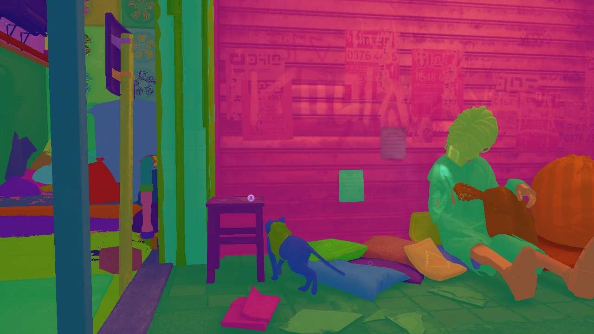

# segcap

Per-pixel object-ID segmentation masks extracted from a running commercial game,
aligned with the rendered frames.

Two retail games, no source, no symbols, shipping binaries with debug names
stripped:

| | engine | result |
|---|---|---|
| **Stray** | UE4, D3D12 | masks over gameplay video, 1:1 aligned, subject tracked |
| **inZOI** | UE5.6 + Nanite, D3D12 | 301-401 masks/run, 79-100% of pixels labelled, live simulation |

Stray is the complete deliverable. inZOI is the harder case and the more
interesting one: on a Nanite title the per-object stencil is not in the
depth-stencil at all, and finding where it *is* took most of the project.

That the labels are real is not argued from the pictures. Clearing exactly one
object's `bRenderCustomDepth` removed **exactly that id's 161,787 pixels and
nothing else** — [`docs/evidence/inzoi-groundtruth-pass.log`](docs/evidence/inzoi-groundtruth-pass.log).
It is the one check here that a coherent-but-wrong mask cannot pass, and getting
it to run at all took two fixes of its own (`DEBUGGING.md` §8.13–8.14).



Every coloured region is one game object with a stable id. The sidecar for that
frame resolves them to `CharacterMesh0` (the cat), `Droid_Head` (B-12),
Morusque's mesh, spline meshes and level geometry — read out of the engine by
reflection at runtime, not hardcoded.

---

## Start here

| | |
|---|---|
| **The demo** | [`docs/evidence/stray-gameplay-demo.mp4`](docs/evidence/stray-gameplay-demo.mp4) — 30s real-time, rendered left, labelled mask right, live controller panel |
| **inZOI** | [`docs/evidence/inzoi-gameplay-demo.mp4`](docs/evidence/inzoi-gameplay-demo.mp4) — masks over live gameplay, 1:1 aligned ([smaller copy](docs/evidence/inzoi-gameplay-demo-small.mp4)); [`inzoi_hq.mp4`](docs/evidence/inzoi_hq.mp4) is the masks alone |
| **Picking this back up** | [`docs/RESUME.md`](docs/RESUME.md) — state, sanity check, and what to do next |
| **The debugging story** | [`docs/DEBUGGING.md`](docs/DEBUGGING.md) — every crash and wrong turn, and what actually found each one |
| **Where AI helped and where it was overridden** | [`docs/AI-USAGE.md`](docs/AI-USAGE.md) |
| **Output format** | [`docs/FORMAT.md`](docs/FORMAT.md) — masks, sidecars, actions, container |
| **PSO vs dynamic state** | [`docs/PIPELINE-STATE.md`](docs/PIPELINE-STATE.md) — why this decided the architecture |

If you read one thing, read `DEBUGGING.md` §7 and §8.

---

## Run it

Nothing here needs a human at the keyboard.

```powershell
.\build.ps1
python tools\capture.py stray --seconds 340
python tools\capture.py inzoi --inject --walk --seconds 200
python tools\capture.py inzoi --preflight     # validate the flow, launch nothing
```

That disables the screensaver, launches the shipping executable suspended,
injects `segcap.dll` before its first D3D call, resumes it, focuses the window,
drives the menus with a virtual Xbox pad, waits for the world to actually finish
loading, resumes the simulation, captures, and restores your settings.

Everything title-specific — where the executable lives, the route through the
menus, which log line means "loaded" — is a `GameProfile` in `tools/games.py`.
The runner is shared, so a fix applies to both titles by construction. That is
not decoration: the two previous run scripts began as a copy and drifted, and
each ended up carrying bugs the other did not.

`--preflight` runs the whole control flow with the game stubbed out, in about a
second. It exists because four runs died to harness mistakes that surfaced only
when their line executed, four minutes in, each costing a loaded game world to
discover.

```powershell
python tools\overlay.py build\bin\segcap_mask_<N>.pgm `
    --frame build\bin\segcap_frame_<N>.ppm --sidecar build\bin\segcap_mask_<N>.json
python tools\identity_report.py --dir build\bin
python tools\verify_labels.py   --dir build\bin
python tools\pack.py --dir build\bin --out session.segcap --verify
python tools\make_demo.py --dir build\bin --out demo.mp4
.\build\bin\test_identity.exe
```

---

## How it works

**Render target identification.** Debug names are stripped in shipping builds,
so the CustomDepth target is elected from runtime-observable signals only:
stencil-capable format, scene resolution (matched by aspect ratio, *not* by
equality with the backbuffer — screen percentage is a thing), cleared every frame
but receiving almost no draws, persistent across frames. Incumbency is **earned**
— a target only gets thrash protection once it has produced a non-empty mask, so
an early wrong guess cannot entrench itself.

**Capture.** `ExecuteCommandLists` is sniffed for the command queue (it is not
reachable from the swapchain). `CreateRTV`/`CreateDSV` map opaque descriptor
handles to resources. `ResourceBarrier` shadows resource state so a transition to
`COPY_SOURCE` is correct rather than guessed. The stencil plane is copied with
`PlaneSlice=1` on the game's own queue into a 3-deep readback ring, collected by
fence polling — never blocking.

**Engine introspection.** `GUObjectArray` is located by structural search, not
byte patterns. Property offsets come from UE4 reflection by name
(`bRenderCustomDepth` is a *packed bit*, mask `0x40`, sharing a byte with
`bUseAsOccluder` — a byte write would corrupt the neighbours). Marking calls the
engine's own `SetRenderCustomDepth` UFunction, because writing the property
directly leaves the render proxy stale and nothing renders.

**Identity in 8 bits.** 255 slots against ~33,000 markable primitives. A slot is
a *lease*, not an identity; a 64-bit `stableId` keyed on `(pointer, serial)` is
the identity, and it survives losing a slot. Slots are leased only to primitives
the engine says it actually drew (`WasRecentlyRendered`), and handed back when
objects leave, so the working set follows the camera.

**Why through the engine rather than the renderer.** Stencil *enable*, *write
mask* and *pass op* are all baked into the PSO; only the reference value is
dynamic. So an injected DLL cannot make the game's draws write arbitrary IDs
without building stencil-writing twins of thousands of PSOs — a shadow renderer,
not instrumentation. UE's CustomDepth pass already has those PSOs and already
feeds `CustomDepthStencilValue` to `OMSetStencilRef`, so the intervention is
setting an integer on a game object. That is also why the ID is 8 bits: it is the
width of the pass the engine already runs. See
[`docs/PIPELINE-STATE.md`](docs/PIPELINE-STATE.md).

**Safety.** Writes happen on the game thread via a proven `ProcessEvent` hook,
are read-modify-write on the masked bit only, are verified after the fact, and
are reversible. The D3D12 hooks stay strictly read-only: none alters an argument,
none issues GPU work.

---

## How things were diagnosed

The full account is `DEBUGGING.md`. The short version, because the method is the
transferable part:

**Read the target's own crash channel first.** UE writes `CrashContext.runtime-xml`
with an error message and a callstack *by module*. "Is our DLL on the stack?" is
the cheapest possible answer to "did we cause it?", and it beats any bisect. It
also misleads: D3D12 reports invalid recorded commands from `Close()`, so a crash
with none of our frames on it is exactly what our own bad copy looks like.

**A refutation is only as good as its scope.** The stale-footprint theory was
killed with "the code revalidates every frame" — true of the Present-path
readback, and silent about the injection ring. Two instances of one class; the
refutation checked the wrong one.

**Remove one variable rather than argue.** After six theories about a crash, one
run with colour capture disabled said more than all of them. The habit of
changing code and reasoning about the result caused three regressions here.

**A number that looks stable is a number nobody is writing.** Every run produced
exactly 61 masks. I read that as a budget, raised `maxCaptures_` from 150 to 600,
saw no change, and continued. The cap was two stale marker files on disk from an
older harness. `ls` would have beaten reading the source, and "my fix had no
effect" should have been a stop signal.

**Thresholds chosen from one observation become "never".** Four separate times:
the id probe judged buffers at 8 leased slots where its own guard is
arithmetically unpassable; "in gameplay" used `marked >= 100`, which the *menu*
also satisfies; "sim running" accepted an object-count delta of +3 out of
564,553; slot eviction fired with slots free and drained the pool from 255 to 57.
Each looked locally reasonable and none separated the cases it existed to
separate.

**Check whether your guard is measuring the data or the world.** The id probe
rejected the correct buffer for being "one big region, not a set of object ids"
while reporting that 100% of its texels carried ids we had leased. The guard asks
"does one value dominate?", which sounds like a property of the buffer and is
actually a property of the room — inZOI's apartment shell is one mesh covering
85% of an indoor view. No threshold separates those, because they are not the
same question. It had also never caught anything: both decoys on record have
three distinct values and die to a different test.

**Direct-from-the-engine is not the same as correct.** `UGameplayStatics::IsGamePaused`
is an authoritative answer to the wrong question — it reports the *engine* pause a
popup menu sets, while inZOI runs its own world clock. It reads false while the
world is frozen.

**Look at the screen.** Hours of theorising about pause coordinates, injected
input filtering and scan codes ended when a single screenshot showed the harness
had been clicking a **loading screen** the whole time. The transport coordinate
was correct from the start; the timing was not.

---

## What is not done

**inZOI's captured colour frames include the game's HUD**, because the frame is
copied from the backbuffer at Present, which is after the UI is composited. The
mask underneath is unaffected — the HUD is not marked and holds no id — so this
is a presentation flaw in the demo, not a labelling one. Copying earlier, before
the UI pass, is the fix.

**One inZOI id holds 56–79% of the frame indoors.** `StaticMeshComponent0` is the
apartment shell: floor, walls and ceiling are one static mesh, so one lease
correctly labels an enormous area. It is accurate and it looks lazy. Splitting it
would mean labelling below the component level, which the CustomDepth pass cannot
express — the stencil value is per primitive. Outdoors the same measure is 30%.

That number is not merely cosmetic: it made the id-probe reject the correct
buffer outright, because the probe's acceptance test treated "one value dominates
the match" as evidence against a buffer when it is really a fact about the room.
`DEBUGGING.md` §8.12.

**inZOI outdoor coverage tops out around 91%**, not 100%. The stencil value is 8
bits — 255 ids — against ~560,000 objects in an open city. Indoor scenes do reach
100%, because a room contains fewer than 255 visible things and the sky sphere is
itself a labelled object. The 255 are spent on whatever fills screen rather than
whatever the object scan reached first.

**inZOI crashes remain unexplained, and one family dominates.** Counting twelve
consecutive crash reports rather than describing the two I remembered: **nine are
`E_ABORT` from the game's own `ResizeBuffers`**, one is the `E_INVALIDARG` from
`Close()` that had absorbed most of the effort, and two are access violations —
a third family the write-up had never mentioned. Neither blocks capture; the
harness retries, and a run that reaches gameplay captures reliably. Eight
candidate explanations are now killed with evidence rather than left as guesses.
`DEBUGGING.md` §8.16.

---

## Measured results

| | |
|---|---|
| Objects per mask | Stray 60–89 distinct ids; inZOI 31–110 (mean 56 outdoors, 97 indoors) |
| Pixels labelled | Stray 94–99.9%; inZOI 79–91% outdoors, 100% indoors |
| Ground truth by intervention (inZOI) | **PASS** — unmarked one object, its 161,787 px (15.8% of frame) went to **exactly 0**; no other id lost pixels |
| Every mask id resolves via its sidecar | **0 unbound**, 0.000% of pixels |
| Identity survives slot loss | 52 objects left and returned; 55 held >1 slot |
| Slot ambiguity within a frame | **0** |
| Identity never renamed | **0 of 344** changed what they named |
| Region is one connected blob | median **1.000**, mean 0.907 |
| Labels that jump against the scene | 3 of 3,068 (0.098%); 2 explained by camera turn |
| Dithered (stipple) regions | 1.0% — UE4 dithered LOD, a real CustomDepth constraint |
| Did we change what the player sees? | **1.04× the noise floor** — PASS |
| Mask compression, lossless | **104.6×** (225/225 records verified byte-identical) |
| Descriptor misses | 0 |

The A/B number needs its context: with a completely static camera, Stray's
temporal AA still changes 12.2% of pixels between two consecutive frames. Judged
against zero, that test reports a visual change every single time regardless of
what you did. The noise floor is the measurement.

---

## Layout

```
src/segcap/      the injected DLL
  hooks.*        D3D12 interception, target election, capture
  readback.*     async GPU->CPU ring
  ue4.*          GUObjectArray, FName, reflection, ProcessEvent
  customdepth.*  visibility-driven marking
  identity.*     slot leases and stable 64-bit ids
src/injector/    suspended launch + inject + resume
src/vpad/        ViGEm virtual Xbox pad
src/tests/       25 assertions, no game required
tools/
  capture.py     one entry point for every title
  games.py       GameProfile: exe, menu route, load signals, per title
  runner.py      the run itself, shared by all titles
  harness.py     Win32 liveness, thread recovery, log waits
  overlay.py     mask -> colourised overlay, with the alignment refusal
  mask_movie.py  masks as video when there is no colour to overlay onto
docs/            DEBUGGING.md, AI-USAGE.md, FORMAT.md, evidence/
```

---

## Notes

Reversible changes to the machine, made deliberately and documented:
`steam_appid.txt` beside each shipping executable (the documented
Steamworks mechanism that stops `SteamAPI_RestartAppIfNecessary` relaunching the
process out from under the injector), and Stray's `GameUserSettings.ini` set to
windowed 1280×720 with a backup at `GameUserSettings.ini.segcap-backup`.

Both games are legitimately owned retail copies. Marking is gated behind a marker
file so a run cannot mutate game state by accident.
